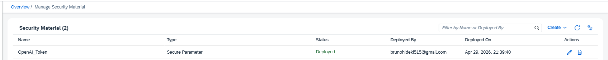

# Configuração de Pré-requisitos

Para que as chamadas à API funcionem corretamente neste iFlow, é obrigatório realizar a configuração prévia da chave de autenticação (Token) no **Security Material** do SAP Cloud Platform Integration (CPI).

## 🔐 Configurando o Token da OpenAI

Siga os passos abaixo para criar o parâmetro de segurança:

1. Acesse o painel do seu tenant no SAP CPI.
2. No menu lateral, navegue até a área de **Monitor** > **Integrations and APIs**.
3. Na seção _Manage Security_, clique em **Security Material**.
4. No canto superior direito, clique em **Create** e selecione a opção **Secure Parameter**.
5. Preencha os dados da seguinte forma:
   - **Name:** `OpenAI_Token` _(Atenção: O nome deve ser exatamente este, pois o iFlow buscará por este alias)._
   - **Secure Parameter:** Cole aqui a sua API Key gerada no portal da OpenAI.
   - **Repeat Secure Parameter:** Cole novamente a API Key para confirmar.
6. Clique em **Deploy**.

Após o deploy, o seu _Security Material_ deverá aparecer na lista com o status `Deployed`, conforme o exemplo abaixo:

> **Nota:** Se ocorrer algum erro de autenticação (HTTP 401) durante o processamento do iFlow, verifique se o status do parâmetro encontra-se como `Deployed` e se o token inserido é válido.
